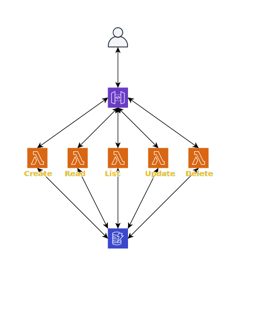

**
AWS Lambda CRUD
**
_
A simple serverless CRUD API using AWS API Gateway, Lambda and DynamoDB
_

-------
When running tests, be sure to create a `.env` file from the `.env-sample`. 
API documentation can be found here: https://documenter.getpostman.com/view/10412215/SzKQzLrL

